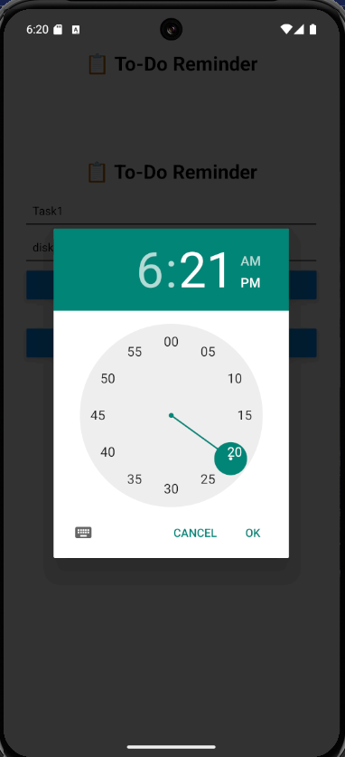
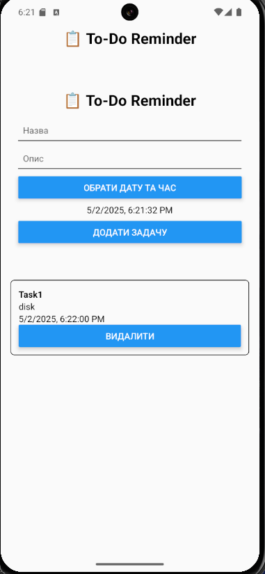

# **Скріншоти**

### Домашній екран


### Вибір часу


### Створене завдання


# **Інструкція по запуску**

### Вимоги
- Node.js
- npm або yarn
- Expo Go
- Android Studio

### Клонуйте репозиторій
```
git clone [url-репозиторію]  
```
### Додайте файли
За допомогою firebase отримати файли google-services.json та GoogleService-Info.plist і встановити їх в корінь проекту

### Додайте ключи OneSignal
В файлі app.config.js в розділі extra додайте ключи oneSignalAppId та oneSignalAPIKey

### Встановіть залежності
```
npm install 
```
або
```
yarn install  
```
### Згенеруйте пакунок додатку на пристрої
```
 npx expo run:android  
```

### Запустіть додаток
```
npx expo start --dev-client
```

### Запуск на емуляторі
Після запуску сервера розробки, натисніть a для запуску на емуляторі Android або i для iOS

### Запуск на фізичному пристрої
Встановіть додаток Expo Go на ваш пристрій  
Відскануйте QR-код, який з'явиться в терміналі або у вікні браузера